# FocusPlan

**Turn any goal into a day-by-day focus plan, and always know what to do right now.**



*How it works, in 5 steps (the same walkthrough plays when the app opens): **1** describe your goal → **2** the AI builds your plan → **3** your day, block by block → **4** check it off → **5** switch plans and see what you've accomplished.*

## Start

Nothing to install except [Python](https://www.python.org/downloads/), which serves the page on your computer. Get the code by cloning the repo, or with **Code → Download ZIP** on this page (then unzip it). Start it from inside the folder:

```bash
git clone https://github.com/Japulgarin/FocusPlan.git
cd FocusPlan
python -m http.server 8766
```

Open **http://localhost:8766**. Downloaded the ZIP on Windows? Just double-click `start.bat` in the folder.

## How to use

1. **✨ Personalize:** pick an AI (DeepSeek is the default and cheapest), paste your API key and press **🔌 Test**.
2. **Describe your goal**, or tap an example (📗 Study, 📘 Exam, 💼 Work…), then pick your dates and wake/sleep times.
3. **✨ Generate plan:** watch it being written day by day, check the preview, then **Save**.
4. **Follow it:** the **Right Now** panel shows what to do this minute. Tick tasks as you go and see your progress.

No API key? Load a ready-made plan from the **"+ example"** pills at the top.

## Features

- **Animated walkthrough**: the 5 steps above, made with SVG + GSAP, with a pause button and a progress bar you can click to jump. It highlights the real ✨ Personalize tab when it closes; replay it with **▶ How it works**.
- **Right Now panel**: a live clock plus a big color-coded status (focus / break / meal / sleep) and the tasks for the current block.
- **Checklist**: every day, every block, every break, in order. Past blocks fade out, the current block is highlighted, and finished blocks get a DONE badge.
- **Daily timeline**: the whole day on one line, with the current moment moved to the top.
- **Up to 10 plans** side by side, each with its dates, icon and progress. Switch with one click.
- **Live progress while generating**: the reply streams in, so you see each step (schedule ready → asking the AI → writing day 2 of 4 → checking the plan) with a timer and progress bar.
- **✨ Personalize (AI plan generator)** in three steps: (1) pick your AI, (2) say what you want to accomplish, (3) pick the dates and your day. You get a preview before you save.
- **Example prompts**: one-tap chips next to the goal box (📗 Study week, 📘 Exam, 🗣️ Language, 📝 Project, 💼 Work) fill in a short prompt, the dates and a matching day rhythm. The chip's icon becomes the plan's icon; for your own goals the AI picks one (e.g. 🏃 for a 5k).
- **🔑 API keys**: **💾 Save key** saves the current provider's key; **🔑 Save keys for other providers** is a compact dropdown for the rest. Providers with a saved key are marked ✓.
- **🔌 Test**: sends just "hi" to confirm your key and the AI are connected before you generate.
- Plans created with AI show your goal (🎯) under the plan name, so the checklist always says what it's for.
- **Example plans** (both generated by FocusPlan with DeepSeek `deepseek-flash`). They start on today's date; remove one with its ✕.
  - 📗 **Normal study week**: 3 relaxed days, 09:00–21:00, 45-minute blocks (691 + 2,970 tokens, about $0.002–0.004).
  - 📘 **Microeconomics exam**: 4 intense days ending on exam day (841 + 6,783 tokens, about $0.004–0.008).
- Follows the real calendar: the app always opens on today.
- No accounts, no server, no build step. Everything is stored in your browser.

## AI providers and models

Only recent, low-cost models are offered. There are no "pro" or premium tiers, and the cheapest model is always listed first and preselected.

| Provider | Key (environment variable name) | Models offered (cheapest first) |
|---|---|---|
| **DeepSeek** (default) | `DEEPSEEK_API_KEY` | `deepseek-flash` |
| Google Gemini | `GEMINI_API_KEY` | `gemini-3.1-flash-lite`, `gemini-3.5-flash-lite`, `gemini-3.8-flash` (all have a free tier) |
| OpenAI (ChatGPT) | `OPENAI_API_KEY` | `gpt-6-luna`, `gpt-5.6-luna`, `gpt-5.4-nano`, `gpt-5.4-mini`, `gpt-6-sol` |
| Anthropic (Claude) | `ANTHROPIC_API_KEY` | `claude-haiku-4-5`, `claude-sonnet-5` |
| OpenRouter | `OPENROUTER_API_KEY` | Live list: the 30 cheapest recent chat models, **free ones first**, with prices |

Prices were checked on 2026-09-25 against each provider's official pricing page. They're kept in `js/providers.js` (`PRICES`). The **↻** button next to the model list keeps only the models your key can actually use.

The environment variable name is shown as a reference. FocusPlan runs in the browser, so you paste the key into the app; it can't read environment variables.

The AI never sets the times. FocusPlan builds the schedule itself (focus blocks, breaks, lunch around 12:30, dinner around 17:30, wind-down) and asks the model only to fill each block with short, concrete tasks. The reply is validated and repaired, so every block of every day ends up assigned.

## Privacy

- FocusPlan has no server. A key is saved only when you press **Save**, and only in this browser's `localStorage` on this device. It is sent only to its own provider when you test or generate, never logged or put in a URL, and never part of the code or the repo. **Forget** removes it. Don't save keys on a shared computer.
- Plans and progress live in `localStorage`, so clearing site data erases them.
- Calls go directly from the browser to the provider. Only use your own key, on your own device.

## Project layout

```
start.bat             double-click to run the app locally (Windows)
publish.bat           double-click to publish to GitHub, with an API-key check
index.html            page shell
css/styles.css        styles (dark theme, mobile-friendly)
docs/how-it-works.svg animated walkthrough shown at the top of this README
js/app.js             rendering: plan switcher, checklist, timeline, Right Now, Personalize
js/demo.js            SVG + GSAP "How it works" animation inside the app
js/schedule.js        builds each day's focus/break/meal schedule; date helpers
js/storage.js         plans, per-plan progress, keys (localStorage)
js/generator.js       prompt, JSON schema, validation and repair of AI output
js/providers.js       DeepSeek / Gemini / OpenAI / Anthropic / OpenRouter adapters and price table
js/plans/b471.js      built-in plan (a 7-day university exam countdown)
js/plans/study.js     example plan: normal study week (AI-generated)
js/plans/micro.js     example plan: Microeconomics exam (AI-generated)
js/plans/examples.js  example list, prompt chips, and loading an example from today
```

## Roadmap

- **Local AI models:** generate plans with **LM Studio** and **llama.cpp** running on your own computer. Both offer an OpenAI-compatible server, so there's no API key and no cost, and nothing leaves your machine.
- **Edit plans you already have:** change the time of a slot, move or resize a focus block, rename a session, and add, remove or reorder tasks.
- **Per-day schedules:** a different wake/sleep time or block length for a single day, or a rest day in the middle of a plan.
- **Carry over unfinished tasks** to the next day with one click.
- **Reminders** when a focus block, break or meal starts.
- **Export and import:** plans as a file to back up or share, and as a calendar (`.ics`).
- **Hosted version** on GitHub Pages, so it runs without downloading anything.

## Publishing changes

Double-click **`publish.bat`**: it stages everything, **refuses to publish if any file looks like it contains an API key** (it lists the files, never the key), asks for a commit message and pushes to GitHub.

## Hosting

The app is fully static, so it can be served with GitHub Pages (Settings → Pages → deploy from `main`).

## License

MIT
